**NOTE**: Click the **Use this template** button in order to create your own repository based on this template.

---
# So you want to take Spacelift for a spin?

This repository is designed just for this purpose. So, fork it to a GitHub account you manage (either your private account or an organization you have admin rights on) and let's get started.

In this tutorial you will not be using any cloud providers, you won't need any extra credentials and the only resources you will manage are the ones managed by [Spacelift's own Terraform provider](https://github.com/spacelift-io/terraform-provider-spacelift/).

## Step 1: Installing GitHub application

Provisioning a Spacelift account is fully automated and only involves [installing the GitHub app](https://github.com/apps/spacelift-io/installations/new). At this point it's up to you to decide whether to give Spacelift access to all your repositories...

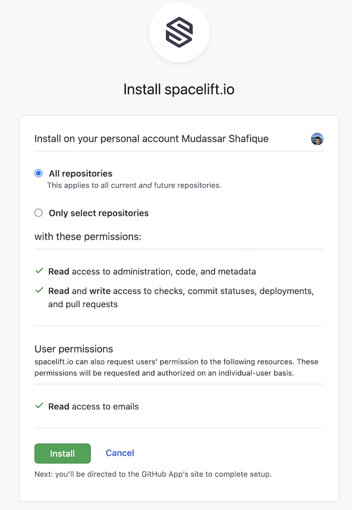

...or just the selected ones:

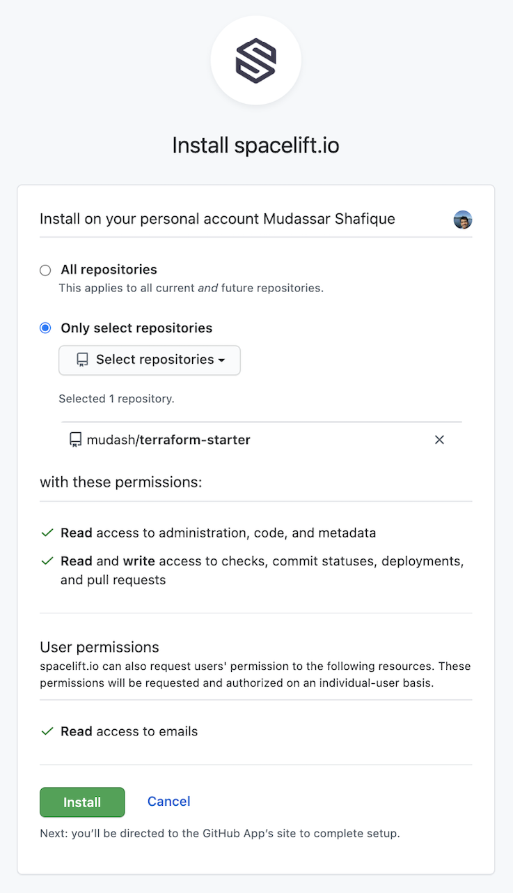

**Note**: don't agonize over this choice - you can always change it later.

Installing the application takes you to your first Spacelift screen where you can create your first stack.

## Step 2: Creating your first stack

[Stacks](https://docs.spacelift.io/concepts/stack) are probably the most important concept in Spacelift. They connect your code and your infra, with some configuration in-between. To keep things short, a Spacelift stack maps directly to a single Terraform state file.

### VCS integration

So without further ado, let's go through the stack creation process step by step. First, we need to tell Spacelift where the project code lives - this is the _Integrate VCS_ step. Since in the previous step I only gave Spacelift access to a single repository (safety first), and this repository only has a single branch, my choices here are rather... limited. But you get the idea - you select the repo, you select the default branch to deploy from and off you go:

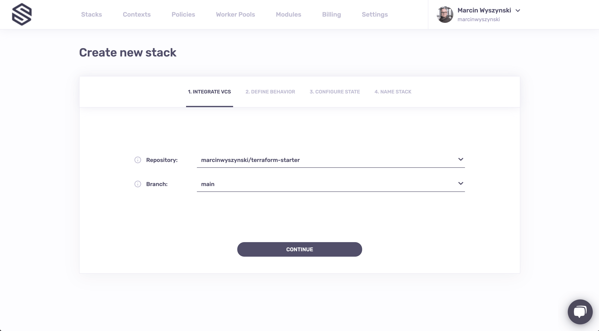

### Configure Backend

In the next step we will choose the backend to use with Spacelift. I am selecting Terraform with a recent version for this tutorial. Spacelift can work with remote state providers but it also provides its own state management - though beyond convenience there are no benefits to using it. We don't have an existing state to import, so we do the most convenient thing there is - continue the defaults:

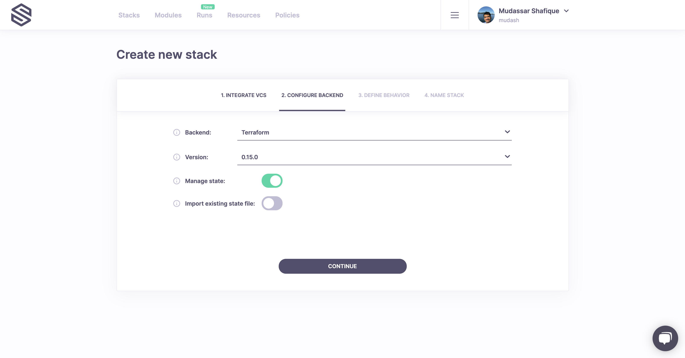

### Stack behavior

In the next step you will define some things about this stack's behavior. Since this is meant to be a quick and snappy tutorial we won't go into the details, but you can read more about them [here](https://docs.spacelift.io/concepts/stack). For now the only tweak we need to do here is to mark the stack as [administrative](https://docs.spacelift.io/concepts/stack/stack-settings#administrative). Why? Because only administrative stacks can manage Spacelift resources and that's what we'll be creating as part of this lab.

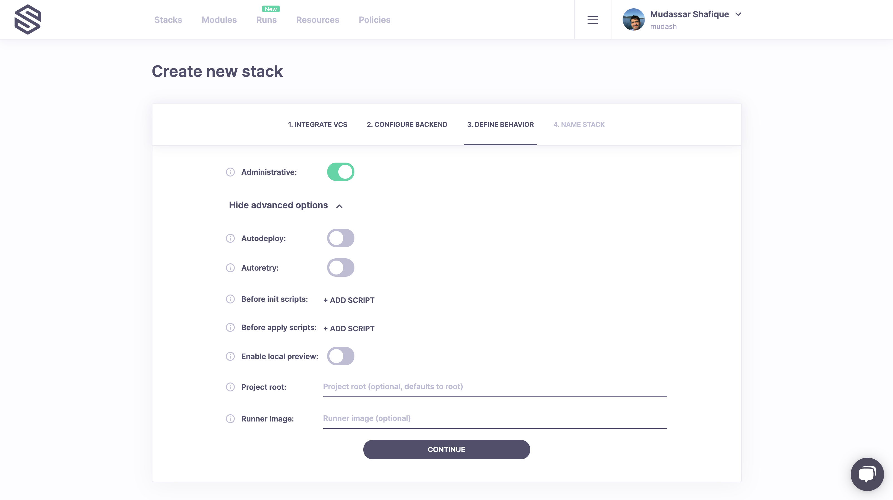

### Naming the stack

As they say, _there are 2 hard problems in computer science: cache invalidation, naming things, and off-by-1 errors_. We'll make it easy this time: we've come up with a good name for your first stack, so feel free copy it. For now we won't care about [labels](https://docs.spacelift.io/concepts/stack#labels) or description (yes, we support Markdown), though you can read up on them when you're done with this lab.

Congrats, you have your first stack. It doesn't do much, but we'll change it in the next step.

## Step 3: Triggering a run

Creating a stack takes you to a very sad looking screen:

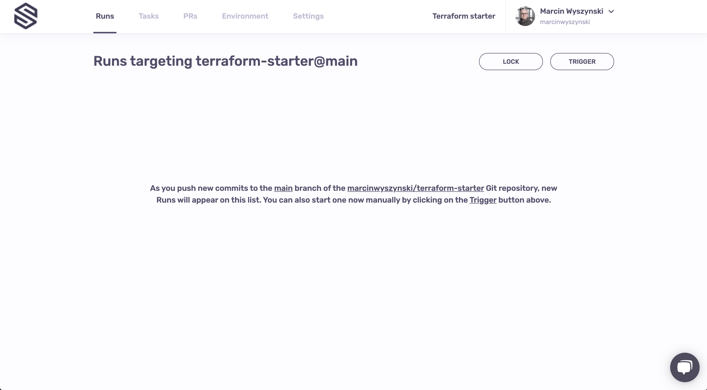

Let's add some color here. We can do that by clicking the _Trigger_ button in the upper right hand corner of the screen. The trigger button will create a Spacelift job that will check out you code, run the usual Terraform commands on it and present you with the choice on whether you want to apply them or not:

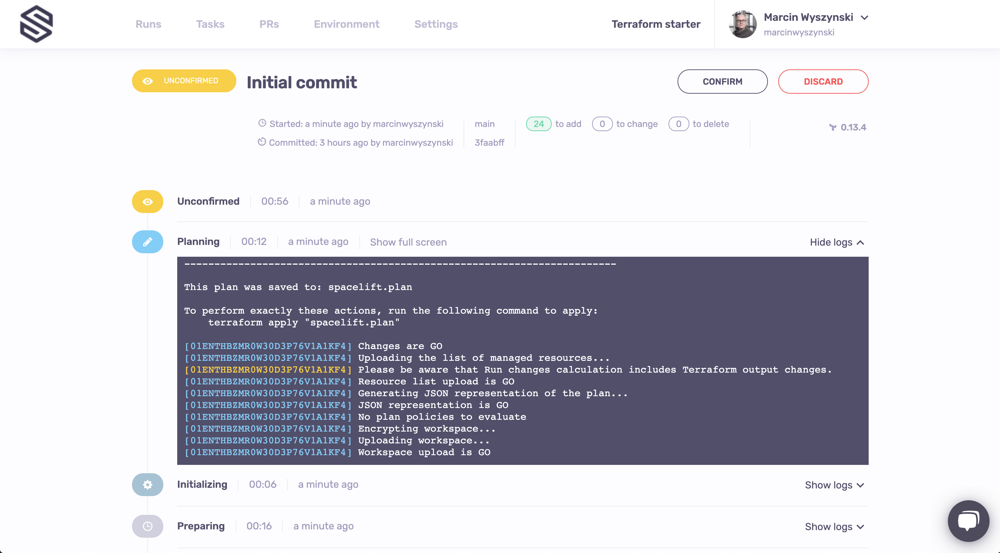

You can always refer to the logs directly to see what's changing. In this case, we're creating 25 Spacelift resources, and they all look good. So let's confirm and see what happens next:

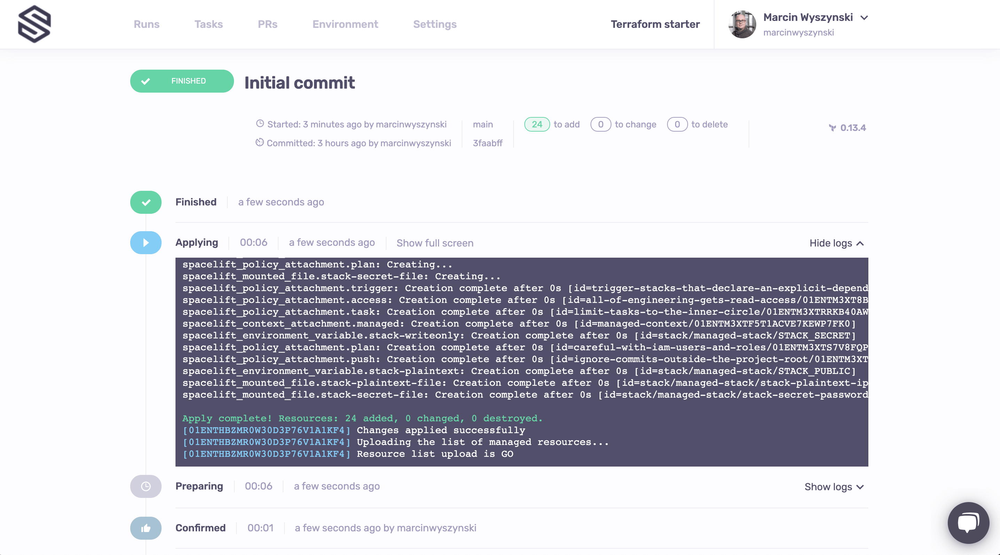

Wow, 10 seconds? That was quick! Let's go back to our main (Stacks) screen to see what we've just done. Clicking on the Spacelift logo on the top left will take you there.

## Step 4: Exploring created resources

What we just did in Step 3 was creating a bunch of very useful Spacelift resources. Looking at the main screen we can quickly notice two things - our _Terraform starter_ stack turned green (always a good sign!) and there's another Stack we haven't seen before, called _Managed stack_:

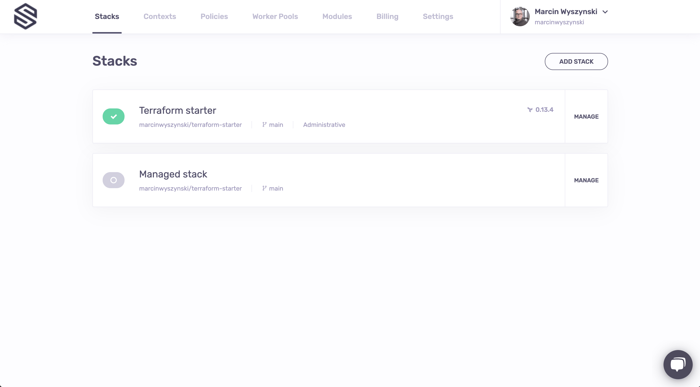

And yes, it's red. Yes, it's normally a bad sign. And yes, this is expected - one of the exercises here is to fix it.

### Environment

Now where did _that_ come from? In fact, we declared it using Terraform just [here](./stack.tf). The same file defines a bunch of things related to the environment, so let's click on the name of the new stack to be taken to its screen. Since it doesn't contain anything interesting just yet, let's quickly navigate to the _Environment_ screen. And it's indeed a very busy screen, so let's just look at the first section there:

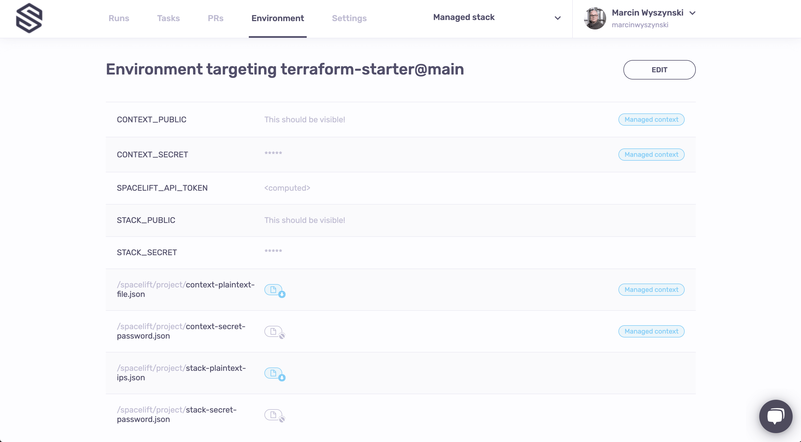

What we see is a bunch of [environment variables](https://docs.spacelift.io/concepts/environment#environment-variables) and [mounted files](https://docs.spacelift.io/concepts/environment#environment-variables) - [some public and some secret](https://docs.spacelift.io/concepts/environment#a-note-on-visibility) - that we indeed saw defined in the [`stack.tf`](./stack.tf) we've only just looked at. But there are others - see the ones with the blue label to their right? Where did they come from? They're actually defined [here](./context.tf) and they belong to a context that's attached to the new Stack.

But before we move on to the context, click the _Edit_ button in the upper right hand corner of the screen and play around with environment variables and mounted files.

### Context

[Contexts](https://docs.spacelift.io/concepts/context) are how Spacelift does configuration reuse. Rather than having to copy and paste a bunch of configuration variables, Spacelift allows you to encapsulate them as a package and [attach](https://docs.spacelift.io/concepts/context#attaching-and-detaching) them to as many stacks as you want. So if you navigate back to the main screen (hint: click on the logo, it normally works like that single button on your iPhone) and then go to the Contexts screen, selecting it from the hamburger menu next to your name, that's what you're going to see:

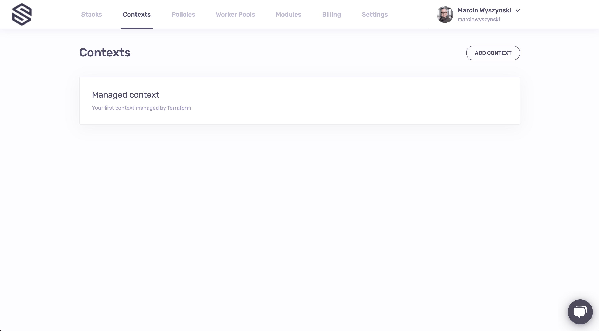

Clicking on the context name takes you to the context screen, where you can see that it currently contains two environment variables (one plaintext and one secret) and two mounted files, one plaintext and one secret:

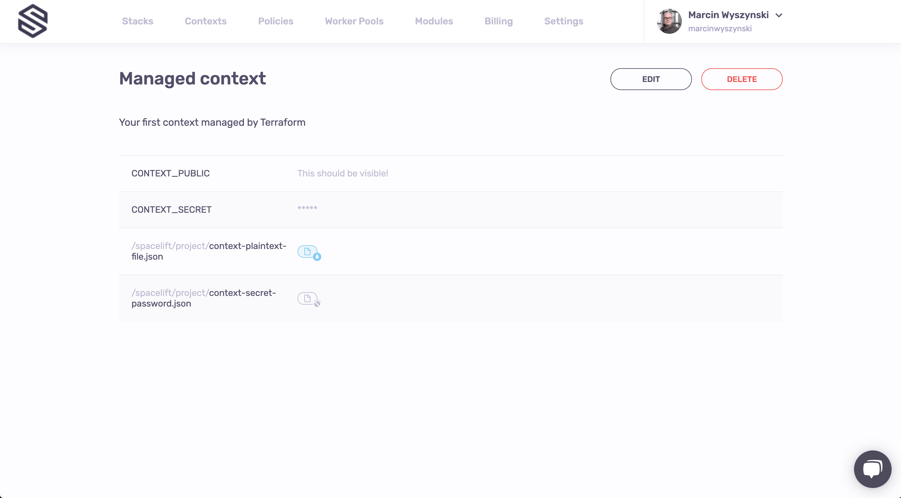

Note that you can edit the context just as you can edit the Stack's own environment. That _Edit_ button is there for a reason, so go wild for a while before we move on to [policies](https://docs.spacelift.io/concepts/policy), which are the second most important topic in Spacelift.

### Policies

When you navigate to the Policies screen, you will see that we've created 6 different policies for you - one of each available types except for the [initialization policy](https://docs.spacelift.io/concepts/policy/run-initialization-policy), which would take a bit longer to explain and thus is not in the scope of this short tutorial.

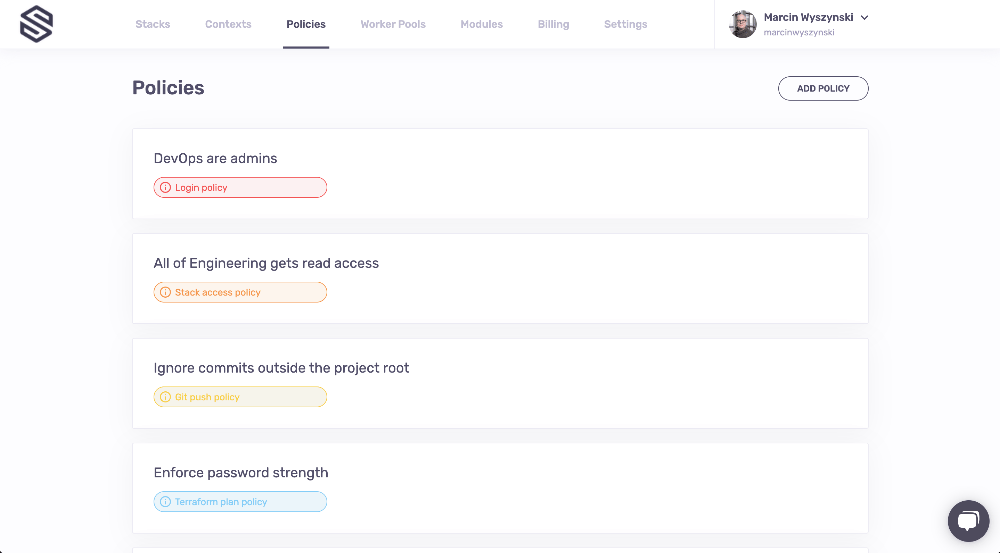

All these policies are defined and explained in the [`policies.tf`](./policies.tf) file, but let's go through them one by one:

- _DevOps are admins_ is a [login policy](https://docs.spacelift.io/concepts/policy/login-policy) that would make anyone who's a member of the _DevOps_ team in your GitHub organization to log in as a Spacelift administrator as opposed to the default situation where only GitHub admin users are automatically Spacelift admins. Note: this changes if you're [using SSO](https://docs.spacelift.io/integrations/single-sign-on) instead of GitHub to authenticate;

- _All of Engineering gets read access_ is an [access policy](https://docs.spacelift.io/concepts/policy/stack-access-policy) that gives any member of the _Engineering_ GitHub team read access to every stack it's attached to;

- _Ignore commits outside the project root_ is a [Git push policy](https://docs.spacelift.io/concepts/policy/git-push-policy) that ignores push notifications which do not affect any files outside of project root of the stack it's attached to;

- _Enforce password strength_ is a [plan policy](https://docs.spacelift.io/concepts/policy/terraform-plan-policy) that prevents you from creating weak passwords using [`random_password`](https://registry.terraform.io/providers/hashicorp/random/latest/docs/resources/password) resource type - we'll see this one in action really soon;

- _Allow only safe commands_ is a [task policy](https://docs.spacelift.io/concepts/policy/task-run-policy) that only allows you to run certain commands as [tasks](https://docs.spacelift.io/concepts/task). This is another one that we're going to try hands-on;

- _Trigger stacks that declare an explicit dependency_ is a [trigger policy](https://docs.spacelift.io/concepts/policy/trigger-policy) that will cause every stack that declares dependency to be triggered when the current one is updated - while this one is probably beyond the scope of the basic tutorial, we wanted to show you that Spacelift is Turing-complete. Also, a trigger policy is what triggered a failing run on the newly created stack 😜

### Policies in practice

While it's worth mentioning that we're using an [open-source language](https://www.openpolicyagent.org/) for our policies, authoring policies is outside of the scope of this tutorial. Instead, we'd like to show you the power of policies hands-on. Let's then navigate to our new stack (_Managed stack_) and try to figure out why the run created by the trigger policy failed? Looks like what we're trying to does not agree with our policy:

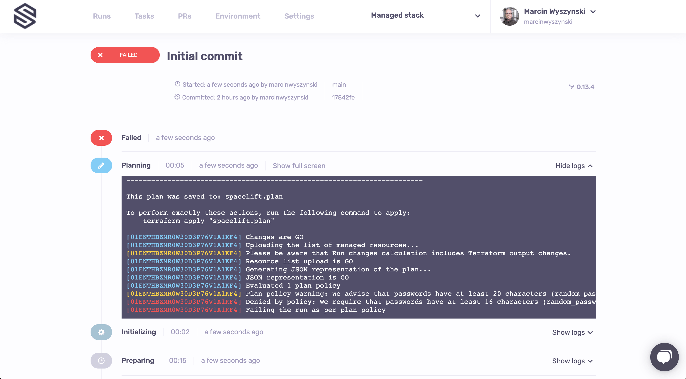

Don't worry for now about fixing it, we will do that in the next step. Instead, let's navigate to our new Stack's Tasks screen and try to run something. How about `terraform destroy -auto-approve`? Nope, didn't work either:

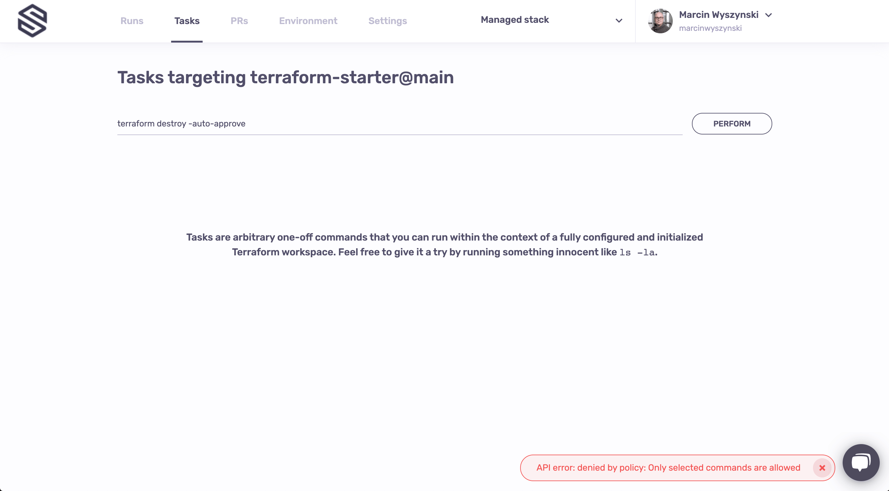

Hint: try running `ls`. Figuring out why it succeeds is an exercise left to the reader.

## Step 5: tests and pull requests

In this step we'll try to fix the problem reported by the plan policy and while doing that we'll see how Spacelift deals with testing your changes and handling Pull Requests. So without further ado, let's make a change to our code to make the random password we're trying to create in this new stack just a little bit longer - let's say 24 characters. Let's also not merge that change to `main` but create a separate branch and open a Pull Request:

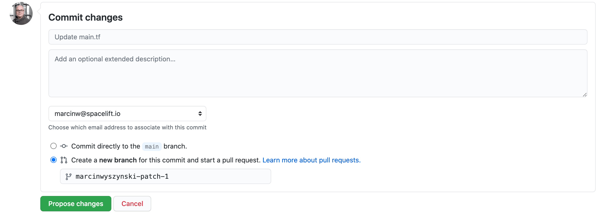

And here's the exact change we're making:

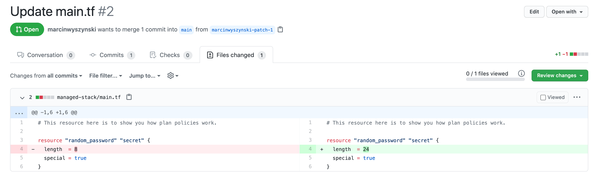

That little change causes two runs to be executed since this repo is now connected to two stacks - one that you created manually and one that is managed programmatically. It's the latter stack we've made changes to, so you will see that there are no changes to the former but one resource would be created for the latter. 

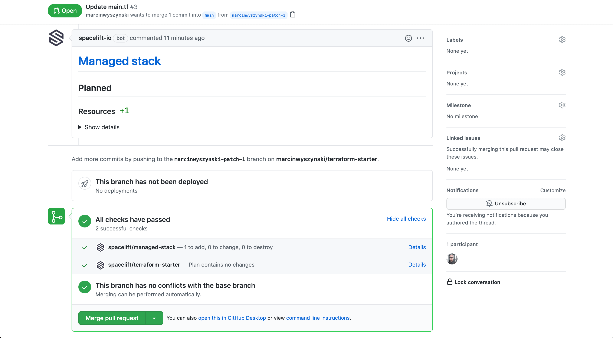

Clicking on the _Details_ link next to the commit status check takes you to the test run for the affected stack. 

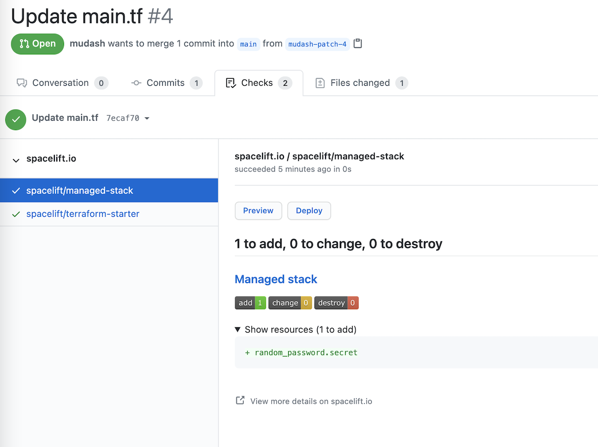

Let's click on _View more details on spacelift.io_ and see what gives under PRs tab for the managed stack:

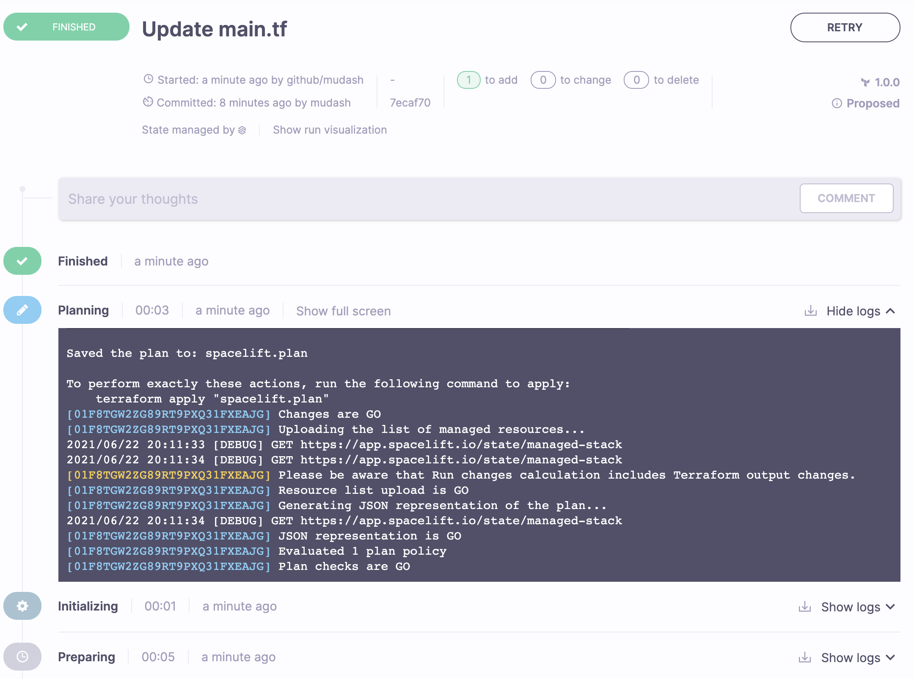

Now that the push policy is happy with the new length of your password, you can merge the Pull Request to the _main_ branch. A run will be created automatically in the _Runs_ tab of your _Managed stack_ which should apply the changes automatically (see the `autoapply` setting in [`stack.tf`](./stack.tf)):

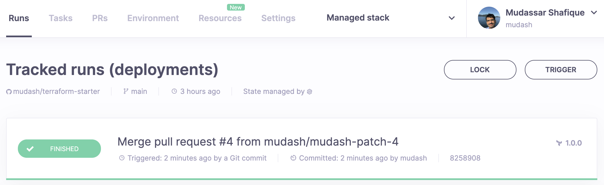

## Congratulations! 👏🏻 

You're a Spacelift expert now 😂 If you like what you've seen so far, here's a few next steps we can suggest:

- [learn more about policies](https://docs.spacelift.io/concepts/policy) and create one from scratch;
- create some resources on a real public cloud;
- [connect your Slack workspace](https://docs.spacelift.io/integrations/slack);
- learn about our native [cloud integrations](https://docs.spacelift.io/integrations/cloud-providers);
- set up [SSO for your organization](https://docs.spacelift.io/integrations/single-sign-on);
- start a [Spacelift agent](https://docs.spacelift.io/concepts/private-worker-pools) in your own infrastructure (yes, it will run on your laptop, too);
